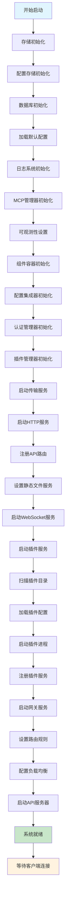
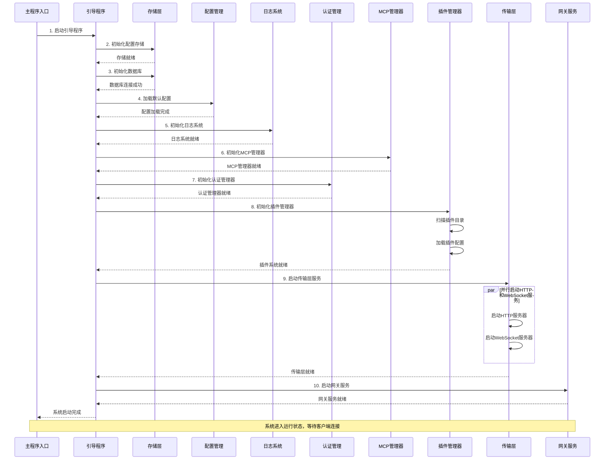
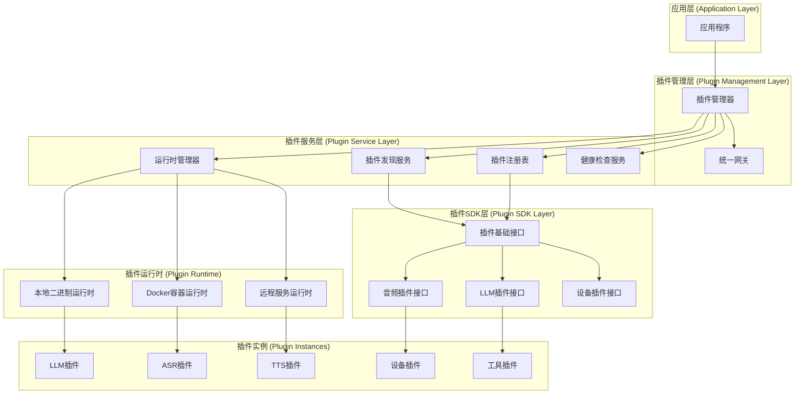
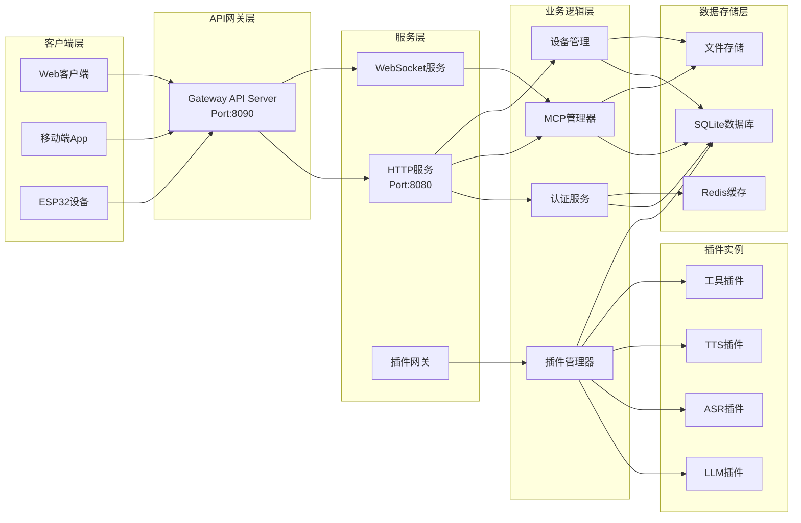
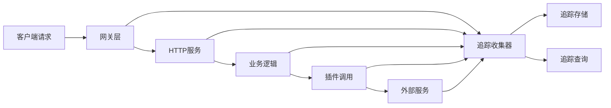

# XiaoZhi Flow 系统架构文档

## 📖 概述

XiaoZhi Flow 是一个企业级语音交互机器人平台，基于 Go 语言开发，采用微服务架构设计，结合多种 AI 模型，通过 MCP (Model Context Protocol) 协议连接多端设备，实现高效自然的人机对话体验。

### 核心特性

- **🎯 智能语音交互** - 集成 ASR、TTS、LLM 等多种 AI 服务
- **🔌 插件化架构** - 支持热插拔的插件生态系统
- **🌐 多端支持** - Web、移动端、ESP32 设备等多平台接入
- **🛡️ 企业级安全** - 多层安全机制和沙箱隔离
- **📊 可观测性** - 完整的监控、日志、追踪体系
- **🚀 云原生部署** - 支持 Docker 和 Kubernetes 部署

---

## 🏗️ 整体系统架构

### 架构分层

```mermaid
graph TB
    subgraph "前端层 (Frontend Layer)"
        A[React Web App] --> B[Ant Design UI]
        A --> C[React Flow流程编辑器]
        A --> D[Zustand状态管理]
        A --> E[Axios HTTP客户端]
    end

    subgraph "网关层 (Gateway Layer)"
        F[Gateway API Server<br/>:8090] --> G[统一网关路由]
        F --> H[负载均衡器]
        F --> I[插件代理]
    end

    subgraph "传输层 (Transport Layer)"
        J[HTTP Server<br/>:8080] --> K[RESTful API]
        J --> L[静态文件服务]
        J --> M[OpenAPI文档]

        N[WebSocket Server] --> O[实时通信]
        N --> P[会话管理]
        N --> Q[消息广播]
    end

    subgraph "业务逻辑层 (Domain Layer)"
        R[认证管理器<br/>AuthManager] --> S[客户端认证]
        R --> T[会话管理]

        U[MCP管理器<br/>MCPManager] --> V[本地工具]
        U --> W[AI模型集成]
        U --> X[外部工具调用]

        Y[插件管理器<br/>PluginManager] --> Z[插件发现]
        Y --> AA[插件生命周期]
        Y --> BB[健康检查]

        CC[设备管理器<br/>DeviceManager] --> DD[设备注册]
        CC --> EE[OTA更新]
        CC --> FF[状态监控]
    end

    subgraph "插件系统 (Plugin System)"
        GG[统一插件网关] --> HH[LLM插件]
        GG --> II[ASR插件]
        GG --> JJ[TTS插件]
        GG --> KK[设备插件]
        GG --> LL[工具插件]
    end

    subgraph "基础设施层 (Infrastructure Layer)"
        MM[配置管理] --> NN[数据库配置]
        MM --> OO[运行时配置]

        PP[存储层] --> QQ[SQLite数据库]
        PP --> RR[文件存储]
        PP --> SS[缓存存储]

        TT[日志系统] --> UU[结构化日志]
        TT --> VV[事件记录]

        WW[可观测性] --> XX[指标收集]
        WW --> YY[分布式追踪]
    end

    A --> J
    A --> N
    F --> J
    F --> N
    J --> R
    J --> U
    J --> Y
    J --> CC
    N --> U
    Y --> GG
    U --> GG
    R --> MM
    U --> MM
    Y --> MM
    CC --> MM
    R --> PP
    U --> PP
    Y --> PP
    CC --> PP
    MM --> TT
    TT --> WW
```



### 技术栈概览

#### 后端技术栈
- **Go 1.24.0** - 主要开发语言
- **Gin** - Web框架
- **GORM** - ORM框架
- **WebSocket** - 实时通信
- **HashiCorp Go-Plugin** - 插件框架
- **SQLite/MySQL/PostgreSQL** - 数据库支持
- **Redis** - 缓存存储
- **JWT** - 身份验证
- **Docker** - 容器化部署

#### 前端技术栈
- **React 19.2.0** - 前端框架
- **TypeScript** - 类型安全
- **Ant Design 6.0** - UI组件库
- **React Flow** - 流程图编辑器
- **Zustand** - 状态管理
- **Axios** - HTTP客户端
- **Three.js** - 3D渲染
- **TanStack Query** - 数据获取

---

## 🚀 系统启动加载流程

### 初始化步骤

系统采用**有向无环图(DAG)式的初始化流程**，通过 `InitGraph()` 函数定义了 11 个有序的初始化步骤：



### 详细启动序列



---

## 🌐 前端应用架构

### 前端目录结构

```
web/
├── src/
│   ├── components/           # React组件
│   │   ├── ErrorBoundary/   # 错误边界
│   │   ├── QueryProvider/   # 数据查询提供者
│   │   ├── SystemInitializer/ # 系统初始化
│   │   └── ProtectedRoute/  # 路由保护
│   ├── pages/               # 页面组件
│   │   ├── Dashboard/       # 主面板
│   │   ├── Login/          # 登录页面
│   │   ├── Register/       # 注册页面
│   │   ├── Setup/          # 设置页面
│   │   └── Config/         # 配置页面
│   ├── contexts/           # React Context
│   ├── hooks/              # 自定义hooks
│   ├── stores/             # Zustand状态管理
│   ├── nodes/              # 节点组件
│   ├── plugins/            # 前端插件
│   ├── services/           # API服务
│   └── types/              # TypeScript类型
├── package.json
└── dist/                   # 构建输出
```

### 前端应用状态

```mermaid
stateDiagram-v2
    [*] --> App初始化
    App初始化 --> 错误边界设置
    错误边界设置 --> QueryProvider配置
    QueryProvider配置 --> AuthProvider配置
    AuthProvider配置 --> 路由系统初始化
    路由系统初始化 --> 系统初始化检查
    系统初始化检查 --> 智能路由判断

    智能路由判断 --> 未认证: 需要登录
    智能路由判断 --> 已认证: 无需登录
    智能路由判断 --> 系统未配置: 需要设置

    未认证 --> 登录页面
    已认证 --> 主面板
    系统未配置 --> 设置页面

    登录页面 --> 认证成功
    认证成功 --> 主面板
    设置页面 --> 配置完成
    配置完成 --> 主面板

    主面板 --> 功能模块:
        功能模块 --> 流程编辑器
        功能模块 --> 配置管理
        功能模块 --> 设备管理

    流程编辑器 --> 运行状态
    配置管理 --> 运行状态
    设备管理 --> 运行状态
    运行状态 --> [*]
```

### 前端核心特性

1. **智能路由系统** - 根据认证状态和系统配置自动导航
2. **错误边界保护** - 全局错误捕获和处理
3. **状态管理** - Zustand + React Query 双重状态管理
4. **组件化设计** - 高度模块化的组件架构
5. **类型安全** - 完整的 TypeScript 类型定义
6. **响应式布局** - 支持多设备尺寸适配

---

## 🔧 后端服务架构

### 核心服务模块

#### 1. 传输层服务

**HTTP服务** (`:8080`)
- RESTful API接口
- 静态文件服务
- OpenAPI文档生成
- SPA路由支持

**WebSocket服务**
- 实时双向通信
- 会话管理
- 消息广播
- 连接池管理

#### 2. 业务逻辑层

**认证管理器 (AuthManager)**
- 客户端注册和认证
- 会话管理和TTL控制
- 多种存储后端支持（内存/SQLite/Redis）
- 密钥生成和验证

**MCP管理器 (MCPManager)**
- 本地工具管理
- XiaoZhi客户端集成
- 外部工具动态注册
- 工具调用缓存（精确缓存+智能缓存）

**设备管理器 (DeviceManager)**
- 设备注册和管理
- OTA固件更新
- 设备状态监控
- 验证码管理

#### 3. 插件管理器 (PluginManager)
- 插件动态发现和加载
- 生命周期管理
- 健康检查和监控
- 沙箱隔离和权限控制

### 数据存储架构

#### 适配器模式设计
```go
type DatabaseAdapter interface {
    GetDB() *gorm.DB
    Close() error
    Migrate() error
}

type SQLiteAdapter struct {
    db *gorm.DB
}
```

#### 数据库特性
- **WAL模式** - 提高并发性能
- **连接池优化** - 针对SQLite优化
- **自动迁移** - GORM AutoMigrate
- **多数据库支持** - SQLite/MySQL/PostgreSQL

#### 数据实体
- `users` - 用户管理
- `devices` - 设备管理
- `auth_clients` - 认证客户端
- `config_records` - 配置记录
- `domain_events` - 事件记录

### 认证授权机制

#### 多层认证架构
1. **客户端认证** - ClientID + Username + Password
2. **会话管理** - 基于TTL的会话机制
3. **密钥管理** - 支持会话密钥生成
4. **存储后端** - 内存/SQLite/Redis

#### 认证流程
```go
func (am *AuthManager) Authenticate(ctx context.Context, clientID, username, password string) (*ClientInfo, bool, error)
```

### API设计

#### 统一响应格式
```json
{
  "success": true,
  "data": {},
  "message": "操作成功",
  "code": 200
}
```

#### 中间件栈
- **CORS中间件** - 跨域请求处理
- **日志中间件** - HTTP请求日志记录
- **可观测性中间件** - 分布式追踪和指标收集
- **恢复中间件** - panic恢复

---

## 🔌 插件系统架构

### 插件系统架构图



### 插件核心组件

#### 1. 插件管理器 (PluginManager)
- **插件发现** - 自动扫描和发现插件
- **生命周期管理** - 加载、初始化、启动、停止、卸载
- **健康监控** - 定期健康检查和指标收集
- **配置管理** - 插件配置的加载和更新

#### 2. 统一插件网关
- **路由转发** - 请求路由到对应插件
- **负载均衡** - 多实例插件负载均衡
- **协议适配** - 统一插件调用协议
- **安全代理** - 插件访问控制和权限管理

#### 3. 插件SDK
```go
// 基础插件接口
type BasePlugin interface {
    Initialize(ctx context.Context, config *InitializeConfig) error
    Shutdown(ctx context.Context) error
    HealthCheck(ctx context.Context) (*HealthStatus, error)
    GetMetrics(ctx context.Context) (*Metrics, error)
    GetInfo() *PluginInfo
    Logger() hclog.Logger
}

// 简化插件接口
type SimplePlugin interface {
    Initialize(ctx context.Context, config *InitializeConfig) error
    Shutdown(ctx context.Context) error
    HealthCheck(ctx context.Context) *HealthStatus
    CallTool(ctx context.Context, req *CallToolRequest) *CallToolResponse
    ListTools(ctx context.Context) *ListToolsResponse
    GetToolSchema(ctx context.Context, req *GetToolSchemaRequest) *GetToolSchemaResponse
}
```

### 插件类型

#### 1. LLM插件
- **功能** - 大语言模型集成
- **支持** - OpenAI、Anthropic、Azure、本地LLM
- **特性** - 流式输出、函数调用、内容过滤

#### 2. ASR插件
- **功能** - 语音识别
- **支持** - 豆包、科大讯飞、Google Speech
- **特性** - 实时识别、多语言支持

#### 3. TTS插件
- **功能** - 语音合成
- **支持** - EdgeTTS、豆包、Azure TTS
- **特性** - 多音色、情感合成、音频流

#### 4. 设备插件
- **功能** - 硬件设备控制
- **支持** - ESP32、Arduino、IoT设备
- **特性** - OTA更新、状态监控

### 插件安全机制

#### 多级沙箱设计
```yaml
security:
  sandbox:
    enabled: true
    type: docker  # docker, gvisor, none
  permissions:
    default: "restricted"
    plugin_policies:
      - name: "hello-plugin"
        permissions: ["execute", "network_outbound"]
```

#### 安全特性
- **进程隔离** - 插件独立进程运行
- **容器隔离** - Docker容器完整隔离
- **资源限制** - CPU、内存、网络限制
- **权限控制** - 细粒度权限管理
- **签名验证** - 插件完整性验证

---

## 📊 数据流架构

### 数据流向图



### 典型数据流

#### 1. 用户认证流程
```
客户端 → 网关 → HTTP服务 → 认证服务 → 数据库 → 返回Token
```

#### 2. 语音交互流程
```
客户端 → WebSocket → MCP管理器 → ASR插件 → LLM插件 → TTS插件 → 返回音频
```

#### 3. 设备管理流程
```
设备 → 网关 → HTTP服务 → 设备管理器 → 数据库 → OTA服务 → 设备
```

#### 4. 插件调用流程
```
客户端 → 网关 → 插件网关 → 插件管理器 → 具体插件 → 返回结果
```

---

## 🔍 可观测性架构

### 日志系统

#### 结构化日志
```go
// 日志格式示例
{
  "timestamp": "2024-01-01T12:00:00Z",
  "level": "INFO",
  "component": "auth",
  "message": "用户认证成功",
  "user_id": "12345",
  "client_id": "web-client",
  "duration": "150ms"
}
```

#### 日志分类
- **业务日志** - 用户操作、业务流程
- **系统日志** - 服务启动、配置变更
- **错误日志** - 异常处理、错误恢复
- **审计日志** - 安全事件、权限变更

### 监控指标

#### 系统指标
- **CPU使用率** - 系统和进程CPU占用
- **内存使用量** - 内存占用和GC情况
- **网络I/O** - 网络吞吐量和连接数
- **磁盘I/O** - 磁盘读写性能

#### 业务指标
- **请求量** - API调用次数和QPS
- **响应时间** - 接口响应延迟分布
- **错误率** - 接口错误率和异常统计
- **用户活跃度** - 在线用户数和会话统计

#### 插件指标
- **插件状态** - 运行状态和健康检查
- **调用次数** - 插件工具调用统计
- **性能指标** - 插件执行时间和资源消耗

### 分布式追踪

#### 追踪架构


#### 追踪信息
- **请求链路** - 完整的请求调用链
- **性能分析** - 各阶段耗时统计
- **错误定位** - 异常发生的精确位置
- **依赖关系** - 服务间依赖关系图

---

## 🚀 部署架构

### 部署模式

#### 1. 单机部署
```yaml
# docker-compose.yml
version: '3.8'
services:
  xiaozhi-flow:
    build: .
    ports:
      - "8080:8080"
      - "8090:8090"
    volumes:
      - ./data:/app/data
      - ./config:/app/config
    environment:
      - LOG_LEVEL=info
      - DB_PATH=/app/data/xiaozhi.db
```

#### 2. 分布式部署
```yaml
# Kubernetes部署
apiVersion: apps/v1
kind: Deployment
metadata:
  name: xiaozhi-flow
spec:
  replicas: 3
  selector:
    matchLabels:
      app: xiaozhi-flow
  template:
    metadata:
      labels:
        app: xiaozhi-flow
    spec:
      containers:
      - name: xiaozhi-flow
        image: xiaozhi-flow:latest
        ports:
        - containerPort: 8080
        - containerPort: 8090
        resources:
          requests:
            memory: "512Mi"
            cpu: "250m"
          limits:
            memory: "1Gi"
            cpu: "500m"
```

### 环境配置

#### 开发环境
- **热重载** - Air工具支持代码热重载
- **调试模式** - 开启详细日志和调试信息
- **模拟数据** - 支持Mock数据和测试插件

#### 生产环境
- **性能优化** - 生产级性能调优
- **安全加固** - 启用所有安全特性
- **监控告警** - 完整的监控和告警系统
- **备份恢复** - 数据备份和灾难恢复

---

## 🔒 安全架构

### 多层安全防护

#### 1. 网络层安全
- **TLS/SSL加密** - HTTPS/WSS通信加密
- **防火墙规则** - 端口和IP访问控制
- **DDoS防护** - 流量清洗和攻击防护

#### 2. 应用层安全
- **身份认证** - JWT令牌认证
- **权限控制** - RBAC角色权限管理
- **API限流** - 请求频率限制
- **输入验证** - 参数校验和SQL注入防护

#### 3. 插件安全
- **沙箱隔离** - 插件运行环境隔离
- **权限最小化** - 插件只获得必要权限
- **资源限制** - CPU、内存、网络限制
- **签名验证** - 插件完整性验证

#### 4. 数据安全
- **数据加密** - 敏感数据加密存储
- **访问审计** - 数据访问日志记录
- **备份加密** - 数据备份加密保护
- **隐私保护** - 用户隐私数据脱敏

### 安全最佳实践

#### 认证授权
```go
// JWT中间件示例
func AuthMiddleware() gin.HandlerFunc {
    return func(c *gin.Context) {
        token := c.GetHeader("Authorization")
        if token == "" {
            c.JSON(401, gin.H{"error": "Missing token"})
            c.Abort()
            return
        }

        claims, err := validateToken(token)
        if err != nil {
            c.JSON(401, gin.H{"error": "Invalid token"})
            c.Abort()
            return
        }

        c.Set("user_id", claims.UserID)
        c.Next()
    }
}
```

#### 插件沙箱
```yaml
# Docker沙箱配置
security:
  sandbox:
    enabled: true
    type: docker
    config:
      network: "none"  # 禁用网络访问
      readonly_rootfs: true  # 只读根文件系统
      user: "nobody"  # 非特权用户
      capabilities:
        drop: ["ALL"]  # 禁用所有能力
```

---

## 📈 性能优化

### 系统性能

#### 数据库优化
- **连接池管理** - 优化数据库连接数
- **索引策略** - 合理设计数据库索引
- **查询优化** - SQL查询性能调优
- **缓存策略** - Redis缓存热点数据

#### 并发处理
- **Goroutine池** - 协程池管理
- **Channel通信** - 高效的协程间通信
- **锁优化** - 减少锁竞争
- **异步处理** - 非阻塞异步操作

#### 内存管理
- **对象池** - 复用频繁创建的对象
- **内存缓存** - 合理使用内存缓存
- **GC调优** - 垃圾回收参数优化
- **内存监控** - 实时内存使用监控

### 插件性能

#### 插件调用优化
- **连接复用** - 复用插件连接
- **批量调用** - 支持批量工具调用
- **结果缓存** - 缓存插件调用结果
- **超时控制** - 合理设置调用超时

#### 资源隔离
- **CPU限制** - 限制插件CPU使用
- **内存限制** - 限制插件内存占用
- **网络限流** - 限制插件网络访问
- **磁盘配额** - 限制插件磁盘使用

---

## 🔄 运维管理

### 配置管理

#### 配置层次
```yaml
# 全局配置
global:
  log_level: info
  max_connections: 1000

# 服务配置
services:
  http:
    port: 8080
    timeout: 30s
  websocket:
    port: 8081
    ping_interval: 30s

# 插件配置
plugins:
  enabled: true
  scan_paths:
    - "./plugins"
    - "/opt/xiaozhi-flow/plugins"
```

#### 热更新支持
- **配置监听** - 监听配置文件变更
- **动态加载** - 无需重启加载新配置
- **配置验证** - 配置文件格式验证
- **回滚机制** - 配置错误自动回滚

### 监控告警

#### 监控指标
- **服务可用性** - 服务健康状态
- **性能指标** - 响应时间、吞吐量
- **资源使用** - CPU、内存、磁盘、网络
- **业务指标** - 用户活跃度、功能使用率

#### 告警规则
```yaml
alerts:
  - name: "HighCPUUsage"
    condition: "cpu_usage > 80"
    duration: "5m"
    severity: "warning"

  - name: "ServiceDown"
    condition: "service_status == 'down'"
    duration: "1m"
    severity: "critical"
```

### 日志管理

#### 日志收集
- **统一日志格式** - 结构化JSON日志
- **日志聚合** - 多服务日志集中收集
- **日志轮转** - 日志文件自动轮转
- **长期存储** - 日志长期保存策略

#### 日志分析
- **实时分析** - 实时日志流分析
- **异常检测** - 自动异常日志识别
- **趋势分析** - 日志趋势统计分析
- **搜索查询** - 强大的日志搜索功能

---

## 🧪 测试策略

### 测试架构

#### 单元测试
- **业务逻辑测试** - 核心业务逻辑单元测试
- **工具函数测试** - 工具函数和帮助方法测试
- **接口测试** - 接口定义和行为测试
- **Mock测试** - 外部依赖Mock测试

#### 集成测试
- **API集成测试** - API接口集成测试
- **数据库集成测试** - 数据库操作集成测试
- **插件集成测试** - 插件系统集成测试
- **第三方服务集成测试** - 外部服务集成测试

#### 端到端测试
- **用户流程测试** - 完整用户操作流程测试
- **性能测试** - 系统性能和负载测试
- **安全测试** - 安全漏洞和渗透测试
- **兼容性测试** - 多平台兼容性测试

### 测试工具

#### 测试框架
```go
// Go测试示例
func TestAuthManager(t *testing.T) {
    tests := []struct {
        name     string
        username string
        password string
        wantErr  bool
    }{
        {"valid user", "admin", "password", false},
        {"invalid user", "invalid", "wrong", true},
    }

    for _, tt := range tests {
        t.Run(tt.name, func(t *testing.T) {
            auth := NewAuthManager(config)
            _, err := auth.Authenticate(context.Background(), tt.username, tt.password)
            if (err != nil) != tt.wantErr {
                t.Errorf("Authenticate() error = %v, wantErr %v", err, tt.wantErr)
            }
        })
    }
}
```

#### 自动化测试
- **CI/CD集成** - 持续集成自动测试
- **测试覆盖率** - 代码覆盖率统计
- **性能基准测试** - 性能基准对比
- **回归测试** - 自动回归测试套件

---

## 📚 开发指南

### 开发环境搭建

#### 环境要求
- **Go 1.24+** - 后端开发语言
- **Node.js 18+** - 前端开发环境
- **Docker** - 容器化开发环境
- **Git** - 版本控制工具

#### 快速开始
```bash
# 克隆项目
git clone https://github.com/your-org/xiaozhi-flow.git
cd xiaozhi-flow

# 安装后端依赖
go mod download

# 安装前端依赖
cd web
npm install

# 启动开发环境
cd ..
make dev  # 启动后端热重载
cd web && npm run dev  # 启动前端开发服务器
```

### 插件开发

#### 插件开发模板
```go
package main

import (
    "context"
    "github.com/hashicorp/go-hclog"
    "xiaozhi-server-go/internal/plugin/sdk"
)

type MyPlugin struct {
    sdk.BasePluginImpl
    logger hclog.Logger
}

func (p *MyPlugin) CallTool(ctx context.Context, req *pluginv1.CallToolRequest) (*pluginv1.CallToolResponse, error) {
    switch req.ToolName {
    case "my_tool":
        return p.myTool(ctx, req.Arguments.AsMap())
    default:
        return nil, fmt.Errorf("unknown tool: %s", req.ToolName)
    }
}

func main() {
    plugin := &MyPlugin{}
    sdk.Serve(plugin)
}
```

#### 插件配置文件
```yaml
# plugin.yaml
name: My Plugin
version: 1.0.0
description: My custom plugin
type: utility
capabilities:
  - my_tool
deployment:
  type: local_binary
  path: ./main.go
  resources:
    max_memory: "256Mi"
    max_cpu: "200m"
```

### 代码规范

#### Go代码规范
- **gofmt** - 代码格式化
- **golint** - 代码风格检查
- **go vet** - 静态代码分析
- **gosec** - 安全漏洞检查

#### TypeScript代码规范
- **ESLint** - 代码质量检查
- **Prettier** - 代码格式化
- **TypeScript** - 类型检查
- **Husky** - Git钩子检查

---

## 🔮 未来规划

### 短期目标 (3-6个月)

#### 功能增强
- **插件市场** - 官方插件市场和分发机制
- **可视化配置** - 图形化配置管理界面
- **多租户支持** - 企业级多租户架构
- **性能优化** - 进一步性能调优和优化

#### 开发体验
- **CLI工具** - 命令行开发工具
- **SDK增强** - 更丰富的插件SDK功能
- **文档完善** - 完整的开发文档和教程
- **示例项目** - 更多插件示例和最佳实践

### 中期目标 (6-12个月)

#### 架构演进
- **微服务化** - 服务进一步拆分和独立部署
- **事件驱动** - 基于事件流的异步架构
- **云原生** - Kubernetes原生部署支持
- **边缘计算** - 边缘设备部署支持

#### 生态建设
- **开源社区** - 开源社区建设和运营
- **合作伙伴** - 第三方插件和服务集成
- **认证体系** - 插件认证和质量保证
- **培训体系** - 开发者培训和认证

### 长期愿景 (1-2年)

#### 技术创新
- **AI增强** - AI驱动的智能运维和优化
- **区块链** - 去中心化插件分发和信任机制
- **WebAssembly** - WASM插件运行时支持
- **低代码** - 低代码插件开发平台

#### 平台化
- **PaaS平台** - 平台即服务能力
- **API经济** - API市场和商业化
- **全球化** - 多语言和全球化支持
- **企业级** - 大型企业级功能和特性

---

## 📞 支持与贡献

### 获取帮助

- **文档中心** - [https://docs.xiaozhi-flow.com](https://docs.xiaozhi-flow.com)
- **API文档** - [https://api.xiaozhi-flow.com](https://api.xiaozhi-flow.com)
- **社区论坛** - [https://community.xiaozhi-flow.com](https://community.xiaozhi-flow.com)
- **GitHub Issues** - [https://github.com/your-org/xiaozhi-flow/issues](https://github.com/your-org/xiaozhi-flow/issues)

### 贡献方式

#### 代码贡献
1. Fork项目仓库
2. 创建功能分支
3. 编写代码和测试
4. 提交Pull Request
5. 代码审查和合并

#### 插件贡献
1. 开发符合规范的插件
2. 编写详细文档和示例
3. 提交到插件市场
4. 社区反馈和优化

#### 文档贡献
1. 改进现有文档
2. 编写教程和最佳实践
3. 翻译文档到多语言
4. 分享使用经验

### 许可证

本项目采用 [MIT License](LICENSE) 开源许可证。

---

## 📄 文档版本

- **文档版本**: v1.0.0
- **最后更新**: 2024-12-02
- **维护团队**: XiaoZhi Flow 开发团队
- **联系方式**: dev@xiaozhi-flow.com

---

*本文档持续更新中，如有问题或建议，欢迎提交Issue或PR。*