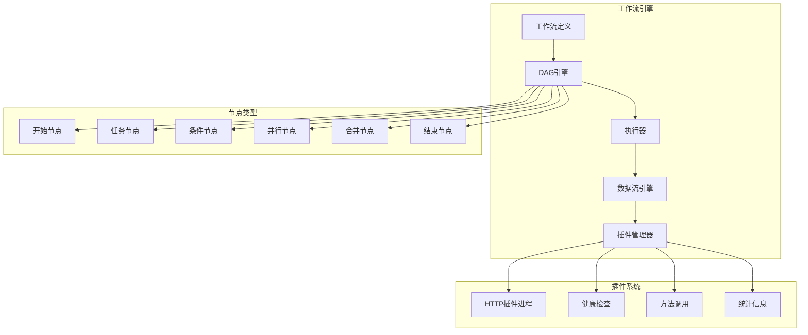
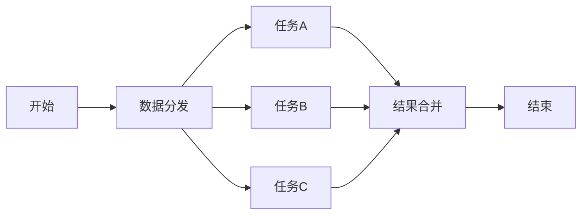

# XiaoZhi Flow 工作流引擎

一个功能完整的DAG工作流执行系统，支持插件化架构、节点Schema定义、数据流传递和并行执行。

## 🚀 核心功能

### 插件进程管理
- ✅ HTTP插件进程模拟器
- ✅ 启动/停止控制
- ✅ 健康检查
- ✅ 统计信息收集

### 节点Schema系统
- ✅ 完整的输入/输出Schema定义
- ✅ 类型验证（string、number、boolean、object、array）
- ✅ 验证规则（长度、范围、正则表达式、枚举）
- ✅ 默认值支持

### DAG拓扑排序
- ✅ Kahn算法实现
- ✅ 循环依赖检测
- ✅ 智能依赖解析
- ✅ 确定性排序输出

### 工作流执行器
- ✅ 顺序和并行执行支持
- ✅ 错误处理和重试机制
- ✅ 超时控制
- ✅ 实时状态监控

### 数据流传递
- ✅ 智能数据路由
- ✅ Schema验证
- ✅ 并行数据合并
- ✅ 表达式求值

## 📁 文件结构

```
internal/workflow/
├── types.go              # 核心类型定义
├── plugin_manager.go     # HTTP插件管理器实现
├── dag_engine.go         # DAG拓扑排序引擎
├── dataflow.go           # 数据流传递机制
├── executor.go           # 工作流执行器
├── example.go            # 完整使用示例
├── workflow_test.go      # 单元测试
└── README.md             # 本文件
```

## 🏗️ 架构设计



## 🎯 节点类型

| 类型 | 说明 | 用途 |
|------|------|------|
| **Start** | 开始节点 | 工作流入口，接收外部输入 |
| **Task** | 任务节点 | 调用插件执行具体任务 |
| **Condition** | 条件节点 | 根据条件决定执行路径 |
| **Parallel** | 并行节点 | 标记并行执行开始 |
| **Merge** | 合并节点 | 合并并行节点结果 |
| **End** | 结束节点 | 工作流结束，收集最终结果 |

## 🔌 插件接口

### HTTP插件端点

| 端点 | 方法 | 说明 |
|------|------|------|
| `/health` | GET | 健康检查 |
| `/call` | POST | 方法调用 |
| `/info` | GET | 插件信息 |

### 调用格式

```json
POST /call
{
    "method": "process_data",
    "payload": {
        "input": "data",
        "options": {}
    }
}
```

## 📊 Schema定义

### 输入Schema

```go
type InputSchema struct {
    Name        string      `json:"name"`
    Type        string      `json:"type"`        // string, number, boolean, object, array
    Required    bool        `json:"required"`
    Default     interface{} `json:"default"`
    Description string      `json:"description"`
    Validation  *Validation `json:"validation"`
}
```

### 验证规则

```go
type Validation struct {
    MinLength *int     `json:"min_length"` // 字符串最小长度
    MaxLength *int     `json:"max_length"` // 字符串最大长度
    Min       *float64 `json:"min"`        // 数字最小值
    Max       *float64 `json:"max"`        // 数字最大值
    Pattern   string   `json:"pattern"`    // 正则表达式
    Enum      []string `json:"enum"`       // 枚举值
}
```

## ⚡ 快速开始

### 1. 运行示例

```bash
cd cmd/workflow-example
go run main.go
```

### 2. 运行测试

```bash
cd internal/workflow
go test -v
```

### 3. 运行性能测试

```bash
cd internal/workflow
go test -bench=.
```

## 📖 使用示例

### 创建工作流

```go
workflow := &workflow.Workflow{
    ID:   "example-workflow",
    Name: "示例工作流",
    Nodes: []workflow.Node{
        {
            ID:   "start",
            Name: "开始",
            Type: workflow.NodeTypeStart,
        },
        {
            ID:     "process",
            Name:   "处理数据",
            Type:   workflow.NodeTypeTask,
            Plugin: "my-plugin",
            Method: "process",
        },
        {
            ID:   "end",
            Name: "结束",
            Type: workflow.NodeTypeEnd,
        },
    },
    Edges: []workflow.Edge{
        {From: "start", To: "process"},
        {From: "process", To: "end"},
    },
}
```

### 执行工作流

```go
// 初始化组件
logger := &workflow.SimpleLogger{}
pluginManager := workflow.NewHTTPPluginManager(logger)
dagEngine := workflow.NewDAGEngine(logger)
dataFlow := workflow.NewDataFlowEngine(dagEngine, logger)
executor := workflow.NewWorkflowExecutor(pluginManager, dagEngine, dataFlow, logger)

// 启动插件
pluginManager.StartPlugin(context.Background(), "my-plugin")

// 执行工作流
execution, err := executor.Execute(context.Background(), workflow, inputs)
```

## 🔄 并行执行

系统支持智能并行执行：

1. **自动识别** - 自动识别可并行节点
2. **并发控制** - 可配置最大并行度
3. **结果合并** - 智能合并并行节点结果
4. **错误隔离** - 单个并行节点失败不影响其他节点

### 并行工作流示例



## 📊 监控和日志

### 执行状态监控

```go
execution, exists := executor.GetExecution(executionID)
if exists {
    fmt.Printf("Status: %s\n", execution.Status)
    fmt.Printf("Completed: %d/%d\n",
        countCompletedNodes(execution),
        len(execution.NodeResults))
}
```

### 插件统计

```go
plugins := pluginManager.ListPlugins()
for id, plugin := range plugins {
    fmt.Printf("Plugin %s:\n", id)
    fmt.Printf("  Calls: %d\n", plugin.Stats.CallCount)
    fmt.Printf("  Success: %d\n", plugin.Stats.SuccessCount)
    fmt.Printf("  Errors: %d\n", plugin.Stats.ErrorCount)
    fmt.Printf("  Avg Latency: %v\n", plugin.Stats.AvgLatency)
}
```

## 🧪 测试覆盖

- ✅ DAG拓扑排序测试
- ✅ 循环依赖检测测试
- ✅ 插件管理器测试
- ✅ 数据流传递测试
- ✅ 工作流执行测试
- ✅ Schema验证测试
- ✅ 并行执行测试
- ✅ 错误处理测试
- ✅ 性能基准测试

## 📈 性能特性

- **高效拓扑排序** - O(V+E)时间复杂度
- **内存优化** - 智能数据结构设计
- **并发安全** - 完整的并发控制
- **可扩展性** - 支持大规模工作流

## 🛡️ 安全特性

- **输入验证** - 严格的数据类型和格式验证
- **沙箱隔离** - 插件进程隔离
- **超时保护** - 多层次超时控制
- **错误边界** - 完善的错误处理机制

## 🔧 配置选项

### 工作流配置

```go
type WorkflowConfig struct {
    Timeout       time.Duration         // 执行超时
    MaxRetries    int                   // 最大重试次数
    ParallelLimit int                   // 并行限制
    EnableLog     bool                  // 启用日志
    Variables     map[string]interface{} // 全局变量
}
```

### 插件配置

```go
type PluginConfig struct {
    HTTP   *HTTPPluginConfig   // HTTP配置
    GRPC   *GRPCPluginConfig   // gRPC配置
    Custom map[string]interface{} // 自定义配置
}
```

## 🚀 扩展性

系统设计支持多种扩展：

1. **插件类型扩展** - 支持HTTP、gRPC等多种插件类型
2. **节点类型扩展** - 可自定义新的节点类型
3. **存储扩展** - 支持多种执行状态存储后端
4. **监控扩展** - 可集成多种监控和日志系统

## 📚 相关文档

- [工作流引擎使用指南](../../docs/workflow-engine.md) - 详细使用文档
- [系统架构文档](../../docs/architecture.md) - 整体架构设计
- [API文档](../../docs/api.md) - API参考文档

## 🤝 贡献

欢迎提交Issue和PR来改进工作流引擎！

### 开发环境

1. Go 1.24+
2. 支持的操作系统：Linux、macOS、Windows

### 代码规范

- 遵循Go语言代码规范
- 添加完整的单元测试
- 提供清晰的文档注释
- 确保并发安全性

---

*XiaoZhi Flow 工作流引擎 - 让复杂的工作流变得简单*